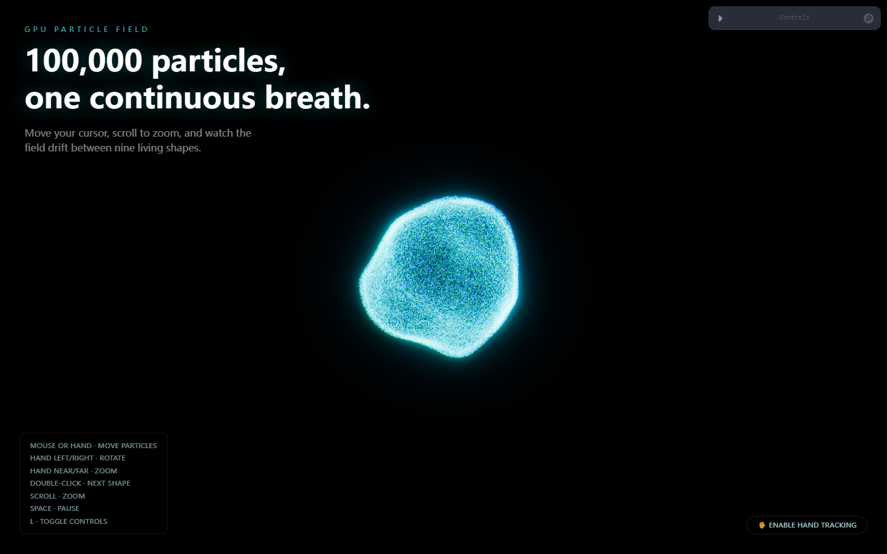

# Particle Experience

**A GPU-driven particle field of 100,000+ glowing points, morphing between nine living shapes, controllable by mouse, keyboard, or your bare hand via webcam.**



Built as an Awwwards-grade interactive hero: everything you see — the morphing, the drift, the cursor repulsion, the camera drive — runs entirely on the GPU through a custom FBO simulation pipeline, so 100k+ particles stay buttery smooth at high frame rates.

## Features

- **100,000+ GPU-simulated particles** — positions live in a ping-pong pair of floating-point render targets, never touching the CPU after initialization.
- **Nine morph targets** — Sphere, Galaxy, Flat Disc, Wave, Torus, Spiral, Explosion, Nebula Cloud, and Random Chaos, blending smoothly into one another every 6 seconds (or on demand) via GPU-side interpolation — never an instant teleport.
- **Organic motion** — a hand-written GLSL simplex-noise field gives every particle a constant, non-repeating "breathing" drift.
- **Three ways to interact:**
  - **Mouse** — moves particles away with a smooth, distance-based falloff, and gives the camera a subtle parallax.
  - **Keyboard** — `Space` to pause, double-click to fast-forward the current morph, `L` to toggle the tuning panel.
  - **Hand tracking** — opt-in webcam control via MediaPipe's HandLandmarker. Your palm position pushes particles and parallaxes the camera; moving your hand left/right rotates the whole scene, and moving it closer/farther from the camera zooms in and out.
- **Full post-processing stack** — bloom (mipmap-based), chromatic aberration, film grain, vignette, and ACES filmic tone mapping.
- **Live tuning panel** (Leva) — noise strength/frequency, cursor repulsion radius/strength, point size and color, camera orbit/float/parallax, all adjustable in real time with zero component re-renders.
- **Fully responsive** — capped device-pixel-ratio for retina displays, touch-aware instructions, and resize handling.

## Tech stack

| Layer | Choice |
|---|---|
| Framework | React 19, Vite, TypeScript |
| 3D / Graphics | Three.js, React Three Fiber, drei, @react-three/postprocessing |
| Shaders | Hand-written GLSL — vertex/fragment particle shaders + a GPU simulation pass, simplex noise |
| Animation | GSAP (hero entrance), Framer Motion (HUD micro-interactions) |
| Hand tracking | MediaPipe Tasks Vision (`HandLandmarker`) |
| Styling | Tailwind CSS v4 |
| Controls | Leva |

## Getting started

```bash
npm install
npm run dev
```

Then open the printed local URL (default `http://localhost:5173`). Building for production:

```bash
npm run build   # type-checks and builds to dist/
npm run preview # serve the production build locally
```

## Controls

| Input | Action |
|---|---|
| Mouse / touch drag | Push particles away |
| Hand (webcam, opt-in) | Push particles, rotate camera, zoom |
| Scroll wheel | Zoom camera |
| Double-click / double-tap | Jump to the next morph shape |
| `Space` | Pause / resume everything |
| `L` | Toggle the Leva tuning panel |

Hand tracking is entirely opt-in — click **"Enable Hand Tracking"** in the bottom-right corner to grant camera access. Nothing touches your webcam until you do.

## Project structure

```
src/
  components/     Experience, Scene, ParticleSimulation, ParticleMaterial,
                   CameraRig, CursorLight, HandTrackingPanel
  hooks/           useMouse, useViewport, useHandTracking
  shaders/         particle.vert/.frag, simulation.vert/.frag (GPU sim)
  utils/           shape generators (sphere, galaxy, wave, torus, ...), math, easing
  state/           lightweight non-React stores for interaction + hand-tracking signals
```

## How it works

The particle system is a classic GPGPU ping-pong simulation: each particle's position lives in one texel of a floating-point texture. Every frame, a full-screen shader pass (`simulation.frag`) reads the previous frame's positions, blends between the current and next morph target, adds simplex-noise drift, applies cursor/hand repulsion, and writes the result to the other render target — which is then sampled directly by the visible point cloud's vertex shader. Nothing about particle motion ever touches JavaScript or the CPU after the initial shape data is uploaded.

## License

MIT — see [LICENSE](LICENSE).
